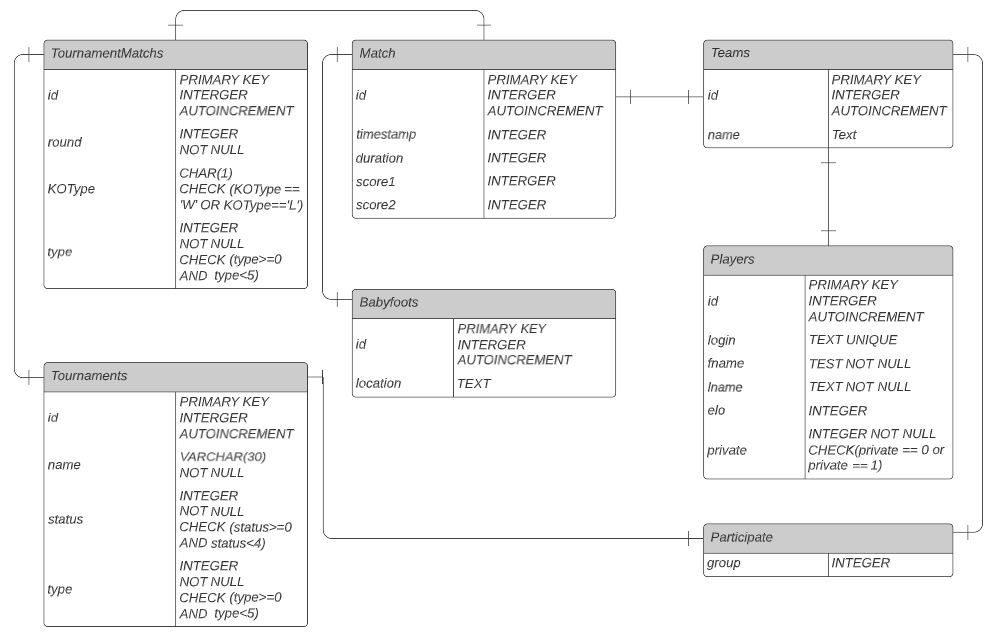
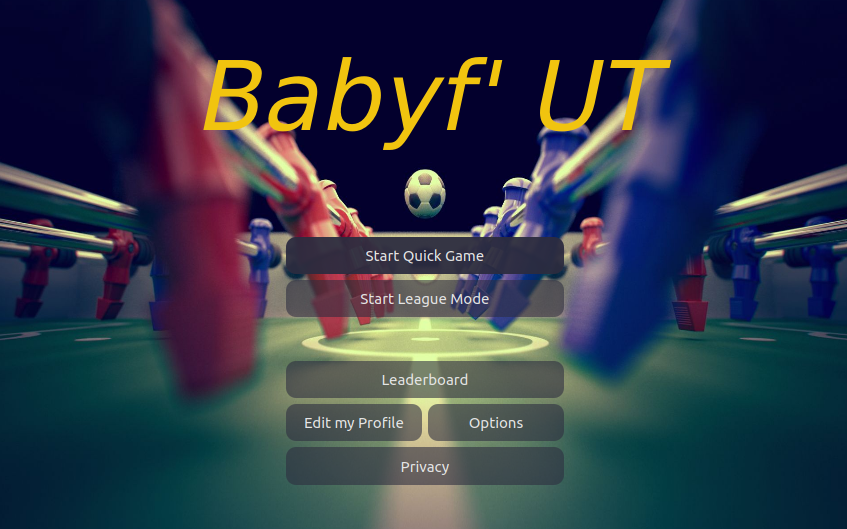

# Introduction #
Vous trouverez dans ce document, une présentation générale du logiciel 
implémenté dans le cadre de la conception d’un babyfoot connecté pour l’UTC.  

## Explication du code ##
### Présentation générale ###
Ce logiciel exécuté sur des Raspberry Pi est réalisé en Python et utilise
extensivement le framework PyQt pour l’affichage et la gestion des interruptions. Le
système est composé de deux Raspberry. L’une exécute le logiciel et centralise les
différents capteurs, elle est appelée “master”. L’autre sert à lire les badges et à
détecter les buts, elle est appelée “slave”.  
  
La structure de ce logiciel est séparée en deux entités : le cœur et les modules.
Le cœur comporte les fonctions communes à l’ensemble du logiciel : gestion de la
fenêtre, des entrées/sorties, de la base de données, etc. Tandis que les modules
sont composés de fonctions spécifiques gérant l’interface et les fonctions de
chargement/déchargement. Le cœur change de module via l’appel de la fonction
switchModule qui effectue les tâches suivantes :  
  
- Déchargement de l'ancien module  
- Afficage du nouveau module  
- Chargement du nouveau module  
- Passage du focus clavier  
  
  
Chaque module possède sa propre fonction switchModule. De ce fait, il ne peut y
avoir à un instant donné qu’un seul module chargé, qui sera donc affiché et lira les
événements clavier. Les modules sont contenus dans le sous-dossier modules/ et
leur interfaces correspondantes sont dans ui/. Par exemple modules/endgame.py
utilise ui/endgame.ui Le cœur est, lui, principalement stocké dans le dossier core/.  
  
Le programme se divise également en 6 threads :  
  
- Principal, gérant l’interface utilisateur et le cycle de vie du logiciel  
- Gestion des téléchargements  
- Gestion de la connexion des slaves  
- Lecture des RFID  
- Détection des buts  
- Enregistrement des replays  
  
### Le Cœur ###
Le cœur du logiciel commence dans babyfut.py, qui contient le main. Il initialise la
fenêtre et les différents threads, exécute les modules puis nettoie les entrées-sorties
et threads une fois la fenêtre fermée.  

#### Les différentes threads ####
Nous avons vu précédemment que le coeur est composé de 6 threads :  

##### Principal #####
Au-delà de la gestion du cycle de vie de l’application, le thread principal permet de
gérer les données qu’il s’agisse de signaux ou de données réelles (ex: attributs d’un
joueur). Enfin, il gère l’appel des différents modules en fonction des signaux qu’il
reçoit. Il va constamment être en attente de messages venant de la raspberry
esclave puis va les traiter et faire les actions nécessaires lors de leur réception.  
  
##### Connexion des slaves #####
Le démarrage de l’application est conditionné par la présence de deux slaves et un
master actifs. Une fois activé, le thread principal est appelé et procède à l’affichage
du menu. Pour pouvoir appeler le thread principal, le logiciel utilise un thread qui
communique à l’utilisateur que le lancement est en cours via un affichage. De plus,
ce thread, lorsque les deux slaves sont actives, lance le thread principal. Le
constructeur de l’application est donc géré par ce thread.  
  
##### Téléchargement #####
Ce thread reçoit des requêtes et télécharge ce qui lui est demandé. Ensuite, il émet
un signal indiquant le chemin local du contenu téléchargé. Une file permet de traiter
les requêtes dans l’ordre d'arrivée. Pour utiliser ce thread, l’application doit
connecter un de ses slots au signal émis par le thread et lancer un téléchargement.
Le slot sera appelé avec le chemin local du fichier téléchargé.  
  
##### Lecture des RFID #####
La lecture du RFID utilise le protocole Serial Peripheral Interface (SPI). Cela
permet au lecteur utilisé d’envoyer un message à la Raspberry Pi lorsqu’il détecte
un émetteur. Côté logiciel, il suffit alors d’attendre l’arrivée du message, d’en extraire
le RFID puis d’émettre un signal au thread principal pour lui indiquer le RFID reçu.
C’est alors au thread principal de construire le joueur associé.  
  
##### Détection des buts #####
La détection de buts utilise un capteur à ultrason. Ce capteur envoie un signal sur un
pin de trigger. Lorsqu’un but est détecté il suffit alors d’émettre un signal qui
préviendra le thread principal de l’événement.  
  
##### Enregistrement des replays #####
Le thread Replay a pour but d’enregistrer la sortie de la caméra.
Pour cela, il crée les objets nécessaires à la lecture de la PICam puis attend qu’un
flag de démarrage soit créé. Le thread est, en réalité, une boucle n’ayant une fin que
lorsqu’il reçoit un signal du cœur. A ce moment, GameModule lance et arrête
l’enregistrement en appelant les fonctions :  
  
- **start_recording**, qui set le flag de démarrage, ce qui va laisser le thread
d’enregistrement s’exécuter et enregistrer la vidéo  
- **stop_recording**, qui set le flag d’arrêt, ce qui va dire au ReplayThread
d’enregistrer la vidéo et de revenir à l’attente de démarrage.
Le thread appelant stop_recording est alors bloqué jusqu’à ce que le replay soit
enregistré.  
  
#### Les entrées-sorties ####
La Raspberry Pi appelle un handler lorsqu’elle détecte un front montant sur un pin
associé aux boutons ou au joystick. Un dictionnaire permet ensuite d’associer un
bouton avec une touche du clavier. Ainsi, l'entrée est lue et peut engendrer l'appel
d’un module ou d’une fonction spécifique.  
  
#### Les données manipulées ####
Nous avons vu précédemment que le thread principal permettait de manipuler des
données.  
Vous trouverez ci-dessous l’UML relatif à ces données. Cet UML ne représente pas
les cardinalités des liens entre les classes. Il permet simplement d’obtenir une vision
globale. La base de donnée est actuellement implémentée en SQLite.  
  
  
### Les modules ###
En fonction des signaux qu’il reçoit, le cœur active un module.  
  
Par exemple, quand le thread ***Connexion des slaves*** perçoit que les deux slaves
sont activés, il envoie au ***Thread principal*** un signal. Suite à la réception de ce
signal, le module ***Menu*** (**menu.py**) est lancé.  
Ce module propose un affichage. L’ensemble des affichages sont créés via le
Designer de Qt qui traduit une interface visuelle en un fichier (.ui).  
  
Ce module propose des boutons permettant d’accéder à d’autres modules. Il est
aussi possible de passer directement au module d’authentification rapide
(authquick.py ) si une carte RFID est scannée d’un côté du babyfoot.  

***autres modules :***  
  
- Authentification Rapide (**authquick.py**)  
Récupère les RFID lus par le Thread IO, récupère les informations sur le joueur,
l’enregistre dans la base de données si ce n’est pas déjà fait. Une fois que la limite
de joueurs (deux par côté) est atteinte ou que les joueurs valident l’authentification,
on envoie la liste de joueurs au module de jeu et on le charge. Par défaut, deux
joueurs dits ‘invités’ sont présents, ce qui permet de lancer une partie sans
s’authentifier. Il est ainsi possible de jouer en 1v1, 1v2, 2v1 et 2v2.  
  
- End Game (**endgame.py**)  
Les statistiques du jeu sont mis à jour en base de données et le ou les vainqueurs
sont affichés.  
  
- Game (**game.py**)  
Il est appelé par un module d’authentification avec la liste des joueurs. Il s’agit du
module de jeu.  
  
- Leaderboard (**leaderboard.py**)  
Il récapitule les statistiques de jeu et permet aux joueurs de se comparer entre eux
via un affichage des scores.  
- Options (**options.py**)  
Ce module permet de changer quelques options du jeu :  
  
  - Type de fin : fin d’un match après x buts ou après x minutes  
  - Choix du mode : tournoi, match  
  - Nombre de joueurs par team  

- Privacy (**privacy.py**)  
Ce module permet d’obtenir des informations sur la base légale du consentement et
du traitement des données.  
  
- Tournament (**tournament.py**)  
Il gère le du jeu en mode tournoi : affichage et score.  
  
- Waiting (**waiting.py**)  
Ce module est utilisé par le thread ***Connexion des slaves*** lors de l’attente de la
connexion d’un ou plusieurs slaves.  
