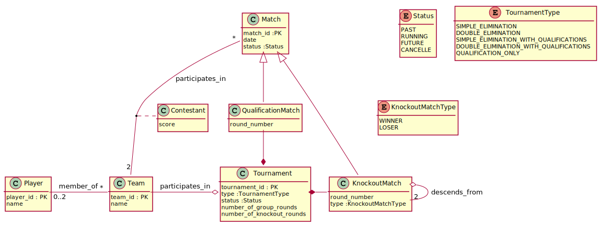

# Gestion Mode tournoi

## Principe

Un utilisateur crée un tournoi, choisit le type (élimination directe, double élimination, avec ou sans poules), des gens s'inscrivent et on clos l'inscription.

À terme, on peut vouloir gérer des tournois selon les modes ci-dessous :

1. [Tournoi a élimination directe simple](https://fr.wikipedia.org/wiki/Tournoi_%C3%A0_%C3%A9limination_directe)
2. [Tournoi à double élimination](https://fr.wikipedia.org/wiki/Tournoi_%C3%A0_double_%C3%A9limination)
3. Avec ou sans phases de qualification

Si on se réfère aux informations de la FFFT, les tournois sont en général 
organisés selon ces modes (voir [ici](https://www.ffft.fr/feuilles-de-gestion-manuelle)).

En fonction du nombre d'équipes inscrites le système décide du nombre de tours de poules (chaque équipe joue deux matchs par tour au plus) si nécessaire et du nombre de tours à élimination directe. Tous les matchs correspondants sont générés en base de données à la validation du tournoi.

Le système propose alors de jouer le prochain match disponible : les membres de l'équipe s'authentifient et le match démarre.

À la fin du match, la base de données est complétée pour valider le match (enregistrement des scores, etc) et le système propose de jouer le match suivant.

Si on fonctionne en mode 'poules', le système oblige à jouer tous les matches de poule. À tout moment, on peut consulter le classement des équipes en fonction de leur goal average.

À la fin de la phase de poules (ou directement si la phase de poules n'est pas activée), le système répartit les équipes dans le premier tour des matches à élimination directe (entièrement ou partiellement. Si le nombre d'équipes n'est pas une puissance de 2, alors certaines équipes rentreront plus tard).

Dans le cas de phases de poules préalables, seul les $2^n$ équipes les mieux classées passent dans la phase d'élimination directe à $n$ tours.

Comme la structure des matchs à élimination directe est créée entièrement au départ, une fois les équipes allouées aux matchs du premier round, il n'y a plus besoin de s'occuper des équipes.

À tout moment, on doit pouvoir visualiser les matchs du tournoi, joués ou à venir.

Une fois tout mis en place, le système propose le premier match à jouer qui est validé comme dans la phase de poule.

## Modèle de données

Pour gérer un tournoi, le modèle de donnée proposé est le suivant :

### Les tournois

Un tournoi (*Tournament*) a un type (en fonction de l'existence de la phase de poule et du type de phase à élimination directe). Tous les matchs à prévoir (matchs de poule *QualificationMatch* et matchs à élimination directe *KnockoutMatch*) doivent être créés dans une phase d'initialisation du tournoi. Si on supprime un tournoi initialisé, tous les matchs prévus disparaissent.

> Note : une fois qu'un match a été joué, le match doit continuer à exister même si on supprime le tournoi, mais ne plus apparaître ni dans les matchs de qualification, ni dans les matchs à élimination directe.

Un tournoi a un certain nombre d'équipes participantes. Une fois le tournoi initialisé (`status` = `RUNNING`) on ne peut plus ajouter des équipes.

Les attributs de nombre de tours de qualification et de tours d'élimination sont définis à priori (soit automatiquement soit manuellement).

### Les matchs

Les match représente une rencontre entre deux équipes. Il peuvent être passés, présents, à venir (attribut `status`).

La participation d'une équipe à un match est matérialisée par la classe `Contestant` qui contient le score réalisé dans un match par une équipe. Chaque match a exactement deux concurrents, mais représenter cette relation à part permet de faciliter certains calculs comme les goal average par exemple.

### Les matchs de groupe

Les matchs de groupe sont des matchs. Ils sont créés afin que chaque équipe joue un seul match par tour (si le nombre d'équipes est impair, il se peut qu'il faille qu'une équipe joue deux matchs un tour sur deux). Le nombre de tours est forcément pair (au moins 2 tours).

Tous les matches de qualification sont créés dès le départ avec les équipes qui leurs sont associées.

### Les matchs d'élimination

Ces matchs sont organisés sous forme d'une arborescence. Chaque match a au plus deux parents (il peuvent n'en avoir qu'un ou aucun). Les parents sont utilisés pour savoir quelles équipes faire participer à un match : soit seulement les deux gagnants des matchs parents (cas de l'élimination simple, soit aussi les deux perdants des matchs parents (cas de l'élimination double).

Pour différencier les matchs entre l'arbre *gagnants* et *perdants*, l'attribut `type` indique l'arbre dont fait partie le match (`WINNERS` ou `LOSERS`).

Dans les deux cas, l'arborescence est créée complètement à priori. Les identités des équipes devant jouer chaque match ne sont connues (et mises à jour) qu'au fur et à mesure du tournoi, à la fin de chaque match.

Une fois le match d'élimination final terminé, le tournoi est clos et on connaît le classement.

En réalisant la bonne arborescence dès le départ, on peut aussi imaginer inclure dans le cas de l'élimination simple une petite finale entre les deux perdants des demi-finales.

Dans le cas de l'élimination double, les 4 premières places sont classées implicitement.

## Notes d'implémentation du modèle de données

### Hiérarchie des matchs

Les héritages peuvent être réalisés de plusieurs manière :

- Mise à plat de la hiérarchie : une seule relation contenant tous les types, les attributs de cette relation sont l'union des attributs de toute la hiérarchie et on ajoute un attribut de type à cette relation pour différentier.
- Autant de relations qu'il y a de classes dans la hiérarchie, chaque relation contient tous les attributs qui lui sont spécifiques.
- Une relation par classe fille de la hiérarchie (ici QualificationMatch et KnockoutMatch), qui contient une clé étrangère vers la base (ici un match dans la table Matchs). Cette clé peut également servir de clé primaire le cas échéant. **Cette solution est la plus simple à utiliser mais demande plus de travail au moteur de BDD**.

Dans notre cas, la troisième solution sera privilégiée à priori.

### Relation Team - Match

On peut une table de relation entre les deux :

> Contestant(**team_id**, **match_id**, score)

L'intérêt est de pouvoir avoir tous les scores d'une équipe dans avoir besoin de se préoccuper de savoir si c'est l'équipe 1 ou 2 de ses matchs, ce qui rendra le calcul de statistiques plus simple au travers de requêtes SQL.

